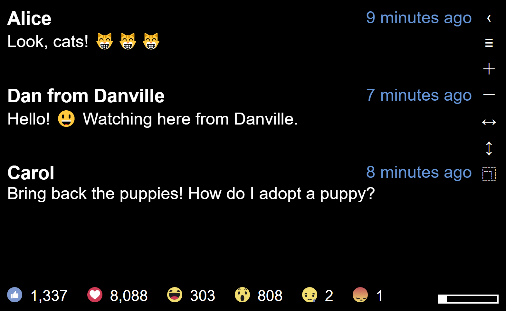

# Live Comments Teleprompter
Display your Facebook Live video comments and reactions in a way that's easy to read.

## Getting Started
1. [Register for a new app ID](https://developers.facebook.com/) for your domain.
2. Use your app ID at the top of js/main.js.
3. Deploy the code to your web server.
4. Go to the page and login with Facebook.

## Usage
Your current Facebook Live video will automatically be selected, viewers' comments and reactions will be displayed.  If you have more than one live video running simultaneously, the most recent will be loaded.

The progress bar in the bottom-right of the view indicates how much time you have before the next batch of comments are loaded.  Click the progress bar to immediately load new comments.

Use the ＋and － buttons, or your browser's zoom controls, to increase or decrease the font size.

Use the ↔ and ↕ buttons to toggle mirroring horizontally and vertically.  This may be needed if you are using a real teleprompter rig.

Use the ⿹ to toggle full-screen mode.

## License
This source code is licensed under the license found in the
LICENSE file in the root directory of this source tree.