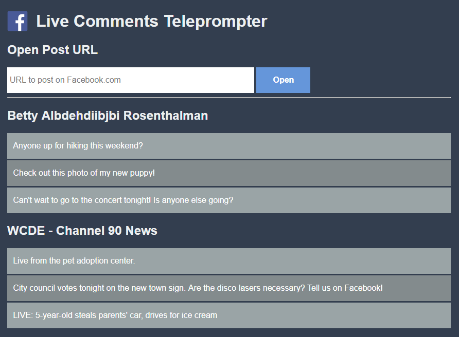
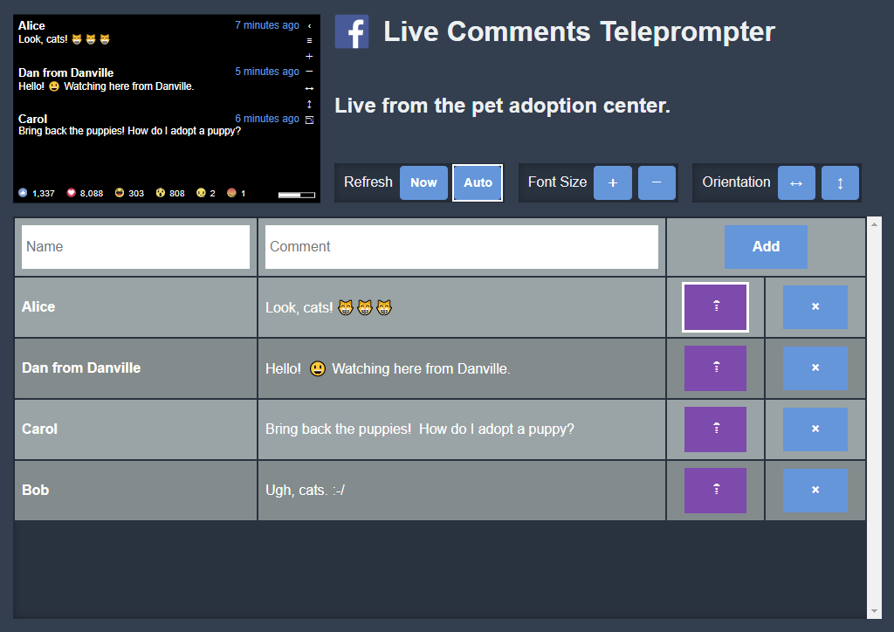

# Live Comments Teleprompter
Display live comments and reactions for Facebook posts in an easy-to-read way.

## Getting Started

The Live Comments Teleprompter is a static web application.  It requires no special server requirements, other than any ordinary HTTP server and a modern browser.  However, you will need to register a Facebook App ID, as it uses the Facebook Graph API and JS SDK.

### Get an App ID

1. [Register for a new app ID](https://developers.facebook.com/) for your domain.
2. In the Facebook App Dashboard, under Basic Settings, add your website URL for where you will deploy the teleprompter.
3. Copy the App ID.  We'll use this in the build step.

### Install Dependencies

This project requires Node.js to build.  (No Node.js server is required however.)  [Download and install Node.js](https://nodejs.org/en/download/) before continuing.

Open a terminal and change to the root directory for the project.  Use NPM to install all the dependencies:

    npm install 

### Build

This step will create bundled JavaScript with your app ID embedded.  Therefore, once built, the build can only work on the URL you registered for your app ID.

Open a terminal and change to the root directory for the project.  Set the `FB_APP_ID` environment variable to your new app ID.

Windows:

    SET FB_APP_ID=12345

Linux / OS X:

    export FB_APP_ID=12345

Next, use Webpack to run the build:

    webpack

(You can also use the `--watch` flag if you're making modifications and want to build as you do that.  You can use `-p` to minify the output bundles.)

Finally, deploy everything in `/src` to your web server.

## Usage

### Post Selection

Choose a post to display comments and reactions for.  Your and your pages' most recent posts will be displayed.  Alternatively, you can paste a URL to many types of Facebook content.

You may also paste URLs to public content from other people and pages.

### Teleprompter

Comments for your post will be loaded and displayed.

The progress bar in the bottom-right of the view indicates how much time you have before the next batch of comments are loaded.  This helps control the flow of comments during very popular videos.  Click the progress bar to immediately load new comments.  You may also use a Bluetooth camera button to immediately load new comments.

Use the back button ‹ to go back to post selection.

Use the ＋and － buttons, or your browser's zoom controls, to increase or decrease the font size.

Use the ↔ and ↕ buttons to toggle mirroring horizontally and vertically.  This may be needed if you are using a proper teleprompter mirror rig.

Use the ⿹ to toggle full-screen mode.

### Moderation

The moderation feature allows you to add, prioritize, and delete posts shown on the teleprompter.  This feature *does not* have any effect on posts on Facebook.  Changes made are for the teleprompter display only.

Use the ≡ on the teleprompter to open the moderation panel.

Comments will flow in the queue, with the most recent comments at the top.  The posts at the top of the queue are what are displayed on the next teleprompter refresh.  If you find an interesting comment, you can boost it to the top of the queue with the ⇡ button.  Once the comment has been read, you should remove it with the × button, so that the next comment in the queue will appear on the teleprompter.

## License
This source code is licensed under the license found in the LICENSE file in the root directory of this source tree.